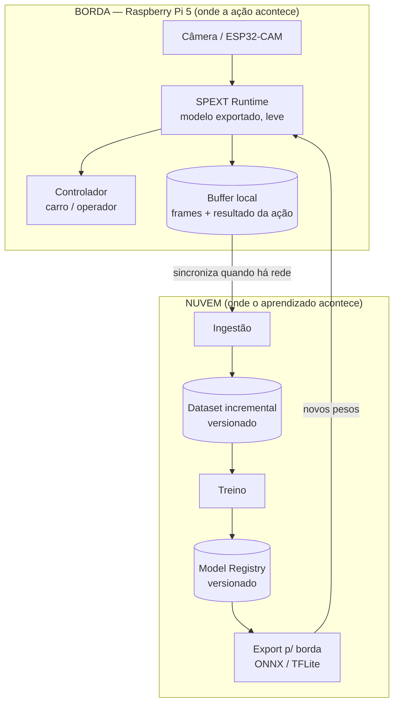
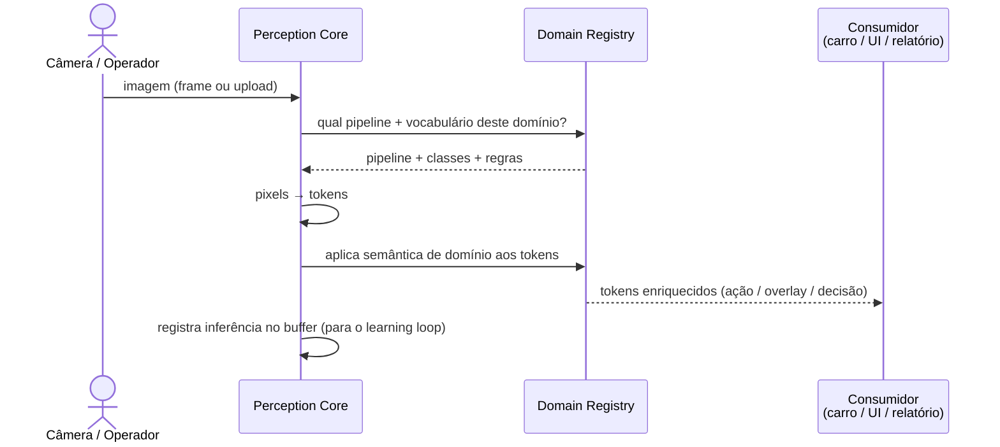

# 02 — Arquitetura

## Princípio organizador: duas metades

O SPEXT é dividido em duas metades com responsabilidades opostas e
complementares. Essa divisão resolve a tensão entre os domínios em batch
(Soja, Baja — precisão importa, latência não) e o domínio em tempo real
(Carro SENAC — latência < 100 ms é lei).



### Regra de ouro

> **A borda nunca treina, só infere e coleta. A nuvem nunca infere em tempo
> real, só treina e versiona.**

O ponto de contato é mínimo e claro:
- **Nuvem → Borda:** um arquivo de pesos exportado.
- **Borda → Nuvem:** um stream de dados de feedback (frames + o que aconteceu).

Isso mantém a borda simples (cabe no Pi 5) e a nuvem livre para usar GPU pesada.

---

## As três camadas do core

Dentro de cada metade, o software se organiza em três camadas. As duas
primeiras já existem (de forma embrionária) nos repos Baja e Soja; a terceira é
o diferencial do SPEXT.

### Camada 1 — Perception Core (`imagem → tokens`)

Contrato único, dois runtimes da **mesma família de modelos**:
- runtime "gordo" na nuvem (treino e avaliação);
- runtime "magro" na borda (modelo exportado).

Ambos produzem o **mesmo vocabulário de tokens**. O Perception Core não sabe o
que é "soja" ou "pintura" — só sabe transformar pixels em tokens usando o
pipeline que o domínio registrou.

### Camada 2 — Domain Registry (o que faz escalar)

Cada domínio é um pacote declarativo:

```text
Domínio = { vocabulário de classes, pipeline de tokenização,
            regras de negócio, thresholds, modelo atual (versão) }
```

Baja, Soja e Carro-SENAC são os três primeiros registros. Um TCC novo é um
registro novo — **zero alteração no core**. Detalhe em
[`04-dominios.md`](04-dominios.md).

### Camada 3 — Learning Loop (o flywheel)

```text
inferência → resultado da ação vira sinal → sobe pra nuvem como amostra
   → entra no dataset do domínio → retreino agendado
   → novo modelo versionado → A/B → re-exporta pra borda
```

É literalmente o "treinado à medida que é utilizado". Detalhe em
[`06-learning-loop.md`](06-learning-loop.md).

---

## Fluxo de inferência (sequence)



---

## Decisões arquiteturais

### Borda vs. Nuvem — por que separar

| | Soja / Baja | Carro SENAC |
|---|---|---|
| Latência | 2–5 s OK | **< 100 ms** |
| Onde roda | nuvem (GPU) | **Pi 5 local** |
| Precisão | crítica | troca por velocidade |

Forçar tudo na nuvem mataria o carro (rede de competição é instável). Forçar
tudo na borda mataria o treino (Pi 5 não treina EfficientNet). A separação em
duas metades é a única que serve aos três domínios sem comprometer nenhum.

### Por que "token" e não "resultado de detecção"

Um *resultado de detecção* é específico de YOLO. Um *token* é agnóstico: serve
para a saída de um detector, de um classificador, de um segmentador, ou de um
encoder de patches. Como Baja (detecção) e Soja (classificação) já provam que
precisamos dos dois, o contrato tem que ser o token. Ver
[`03-contrato-de-token.md`](03-contrato-de-token.md).

### Monorepo

Proposta de organização (a confirmar quando começar o código):

```text
spext/
  core/        # Perception Core + schema de Token (não conhece domínios)
  domains/     # baja/, soja/, carro_senac/  (cada um plugável)
  edge/        # runtime de borda (Pi 5), export de modelos
  cloud/       # ingestão, treino, registry, learning loop
  docs/        # esta documentação
```
