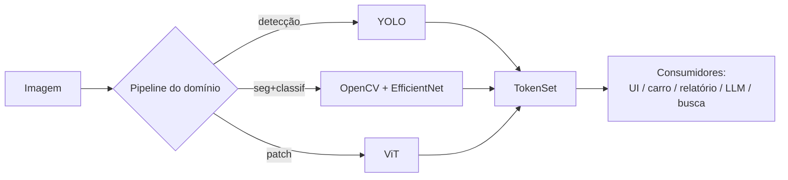

# 03 — Contrato de Token

O **Token** é o coração do SPEXT. É o que faz domínios diferentes e pipelines
diferentes serem o mesmo sistema. Tudo no SPEXT produz ou consome tokens.

## Por que tokens

Um defeito de pintura, um grão ardido e um obstáculo na pista são, para o core,
a mesma coisa: uma **região da imagem com um significado e uma confiança**. Se o
sistema representa todos eles com a mesma estrutura, então:

- um único frontend desenha overlay para qualquer domínio;
- um único mecanismo de busca/histórico funciona para todos;
- um LLM pode raciocinar sobre qualquer inspeção ("quantos grãos ardidos neste
  lote?");
- a saída pode virar relatório, comando de carro ou alerta — sem o core saber a
  diferença.

A tokenização **não é uma feature** do SPEXT. É a **interface** dele.

## O schema (conceitual)

```jsonc
Token {
  // identidade semântica
  classe:     "soja_ardida",        // rótulo do vocabulário do domínio
  dominio:    "soja",

  // localização
  bbox:       [x1, y1, x2, y2],     // pixels na imagem original
  mask:       null,                  // opcional: máscara de segmentação

  // confiança
  confianca:  0.89,                  // 0..1

  // representação vetorial (opcional, habilita busca/similaridade)
  embedding:  [0.12, -0.03, ...],

  // semântica de negócio (preenchida pelo domínio, não pelo core)
  semantica:  {
    decisao:   "expulso",            // Premium / Matéria-prima / Expulso
    severidade: "alta"
  }
}
```

E o agregado de uma imagem:

```jsonc
TokenSet {
  tokens:       [ Token, Token, ... ],
  image_size:   [w, h],
  dominio:      "soja",
  modelo:       "soja_finetuned_final@v3",  // versão exata que gerou
  inferencia_ms: 41.2,
  fonte:        "upload" | "stream",
  demo_mode:    false                        // true enquanto pesos genéricos
}
```

> `modelo` carrega a **versão exata** que gerou os tokens. Isso é essencial para
> o learning loop e para reprodutibilidade científica (ver
> [`06-learning-loop.md`](06-learning-loop.md)).

## Pipelines de tokenização — o core aceita vários

O ponto crucial descoberto ao analisar Baja e Soja: **eles tokenizam de formas
diferentes e mesmo assim produzem o mesmo `Token`.** O core precisa suportar
múltiplos pipelines plugáveis:

| Pipeline | Como gera o token | Quem usa hoje |
|---|---|---|
| **Detecção** (YOLO/RT-DETR) | rede devolve caixas + classe direto | Baja |
| **Segmentação + classificação** | OpenCV recorta cada objeto → classificador rotula cada recorte → caixa vem do recorte | Soja (EfficientNet-B0) |
| **Patch/embedding** (ViT) — *futuro* | imagem fatiada em patches → embeddings → tokens sem classe fixa | linha de pesquisa |
| **Codebook discreto** (VQ-VAE) — *futuro* | imagem → tokens de um vocabulário visual aprendido | linha de pesquisa |

O domínio escolhe seu pipeline no registro. O resto do SPEXT não muda.



## Níveis de tokenização (roadmap conceitual)

Do mais concreto (e já viável hoje) ao mais ambicioso:

1. **Tokens de objeto** — cada detecção/recorte é um token. **É o nível atual** e
   já unifica Baja e Soja. Habilita busca, histórico, relatório, e alimentar LLM.
2. **Tokens de patch (ViT)** — controle sobre o backbone, base para modelos
   próprios.
3. **Tokens discretos (VQ-VAE/VQ-GAN)** — vocabulário visual aprendido; abre
   geração e pré-treino auto-supervisionado.

A arquitetura é desenhada para começar no nível 1 sem fechar a porta para 2 e 3 —
porque o contrato `Token`/`TokenSet` é o mesmo; só muda quem o produz.

## Implicação prática

O **primeiro código a existir no SPEXT** deve ser o schema do Token (Pydantic).
Ele é o contrato do qual todo o resto depende. Ver `CLAUDE.md §6`.
