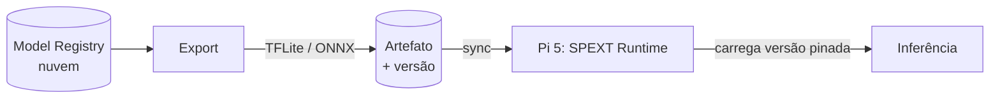

# 05 — Borda (Raspberry Pi 5)

Esta é a metade do SPEXT que **roda onde a ação acontece**. Hoje, o único
hardware de borda disponível é o **Raspberry Pi 5**. Este documento registra o
que cabe nele, o papel do ESP32, e como o modelo chega lá.

## Hardware disponível hoje

- **Raspberry Pi 5** (único). É o cérebro de borda.
- ESP32 / ESP32-CAM: **ainda não em mãos**, mas mapeado como papel futuro
  (sensor/atuador, ver abaixo).

## O que o Pi 5 consegue rodar

| Modelo | Cabe no Pi 5? | Observação |
|---|---|---|
| EfficientNet-B0 (29 MB, Keras→TFLite) | ✅ | poucos a dezenas de FPS conforme otimização |
| YOLO nano (ONNX/TFLite) | ✅ | viável para detecção leve |
| RT-DETR / modelos grandes | ⚠️ | só com folga de latência; não para o carro |

O Pi 5 atende ao orçamento de **< 100 ms** do carro com modelo leve + quantização.
Treino **nunca** roda no Pi — só inferência e coleta (regra de ouro,
[`02-arquitetura.md`](02-arquitetura.md)).

## Reality check: ESP32 NÃO roda os modelos atuais

Registrado de propósito, porque é uma decisão de arquitetura, não detalhe:

- **EfficientNet-B0 = 29 MB.** ESP32 tem ~520 KB de RAM e ~4 MB de flash. Mesmo
  quantizado int8 (~5–7 MB), **não cabe**. ESP32 + TFLite Micro só roda modelos
  minúsculos (ex.: "person detection" ~250 KB).
- Conclusão: **ESP32 é sensor/atuador, não unidade de inferência.**

### Papel de cada peça (arquitetura típica de competição)

```text
ESP32-CAM  →  captura frame
                 ↓ (USB / WiFi local)
Raspberry Pi 5  →  inferência (SPEXT Runtime) → token → decisão
                 ↓
ESP32 / driver  →  aciona motor / direção
```

Os dois convivem: cada um no seu papel. Quando houver ESP32 em mãos, ele entra
como olho (captura) e mão (atuação); o Pi continua sendo o cérebro.

> **Linha de pesquisa / TCC:** destilar um modelo pequeno o suficiente para rodar
> *na própria* ESP32 (de 29 MB para < 1 MB) é um TCC inteiro de model compression
> (quantização, pruning, knowledge distillation, arquiteturas tiny). Fica no
> roadmap, não no caminho crítico.

## Como o modelo chega na borda



- Nuvem treina (Keras/Ultralytics) → exporta para **TFLite** (Keras) ou **ONNX**
  (YOLO) → quantiza → publica artefato **versionado**.
- O Pi baixa o artefato quando há rede e **fixa a versão** que está rodando
  (essa versão vai dentro de cada `TokenSet`, para rastreabilidade).
- Troca de modelo na borda = baixar novo artefato + apontar o runtime para ele.
  Sem recompilar, sem retreinar localmente.

## Runtime de borda — requisitos

- Carregar um modelo exportado e expor inferência local (sem depender de rede).
- Produzir `TokenSet` no mesmo contrato da nuvem ([`03-contrato-de-token.md`](03-contrato-de-token.md)).
- Manter **buffer local** de (frame + resultado da ação) para o learning loop,
  resiliente a ficar offline.
- Sincronizar o buffer com a nuvem **quando houver rede** (a rede da competição é
  instável — a borda precisa funcionar sozinha).

## Primeiro marco de borda

Provar, no Pi 5, o caminho completo: **modelo exportado → inferência local →
TokenSet → buffer**. Sem isso, o domínio do carro não existe. É o teste que
valida a metade de borda inteira.
