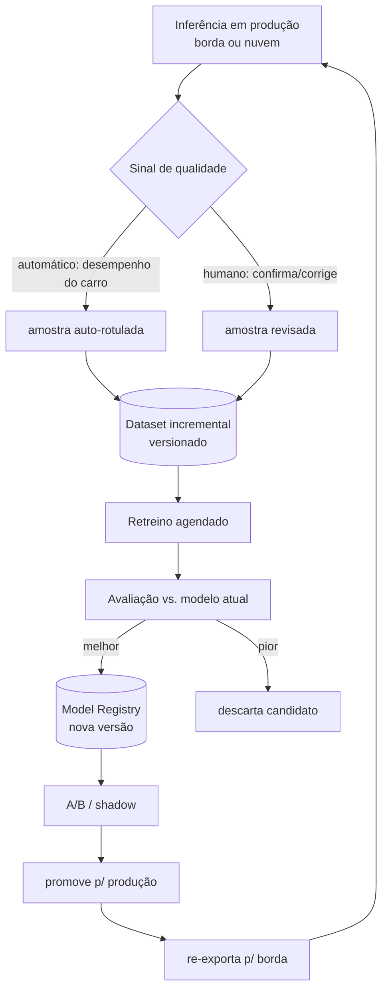

# 06 — Learning Loop (melhoria progressiva)

Este é o diferencial do SPEXT em relação a qualquer SaaS de visão: o sistema
**aprende à medida que é usado**. Dataset e modelos **melhoram progressivamente**
— por decisão explícita do dono do projeto, isso é **fundação, não fase futura**.

## Por que é fundação, não fase futura

Os datasets de Baja e Soja **vão continuar sendo melhorados**, e os modelos
**serão retreinados progressivamente**. Se versionamento e rastreabilidade não
existirem desde o primeiro dia, cada melhoria vira um modelo órfão sem histórico,
impossível de comparar ou reverter. Logo:

- **todo dataset é versionado** desde o início;
- **todo modelo carrega sua versão** dentro do `TokenSet` que produz;
- **toda inferência é registrável** como amostra potencial de treino.

## O loop

## As duas fontes de feedback

| Fonte | Domínios | Como funciona |
|---|---|---|
| **Humano** | Baja, Soja | operador confirma ou corrige os tokens; correções viram rótulos de alta qualidade |
| **Automático** | Carro SENAC | o resultado da ação (bateu / completou volta / tempo) é ground truth implícito; não precisa de anotação manual |

O carro é o caso que prova o loop **sem humano no meio** — o sinal mais barato e
escalável de todos.

## Versionamento — o que é rastreado

### Datasets

- Cada versão do dataset é imutável e identificável (ex.: `soja-ds@2026.06`).
- Novas amostras (coleta própria, fotos de celular, correções) entram como
  **incremento versionado**, nunca sobrescrevendo o anterior.
- A divisão treino/val/teste é fixada por versão para comparações justas.

### Modelos (Model Registry)

- Cada peso treinado é uma **versão** com metadados: dataset de origem,
  hiperparâmetros, métricas (mAP / acurácia / matriz de confusão), data.
- O `TokenSet` carrega a versão exata do modelo (`modelo: "soja_finetuned_final@v3"`)
  → qualquer resultado é reprodutível e rastreável.
- Modelos antigos nunca são apagados — permitem **reverter** e **comparar**.

> A Soja já produz isso de forma embrionária: `phase1` → `phase2` → `final` →
> `finetuned` são, na prática, versões progressivas. O SPEXT formaliza esse
> padrão para todos os domínios.

## Promoção de modelo (nunca trocar às cegas)

1. **Candidato** é treinado a partir de um dataset versionado.
2. **Avaliação** contra o modelo de produção no mesmo conjunto de teste.
3. Só promove se for **melhor** nas métricas que importam ao domínio (ex.: para
   `soja_ardida`, recall acima de tudo — tolerância zero).
4. **A/B ou shadow** antes de virar padrão, quando possível.
5. Promovido → re-exporta para a borda (TFLite/ONNX).

## Implicação prática

Antes de qualquer modelo "de produção", o SPEXT precisa de:
- um **registro de dataset** versionado;
- um **registro de modelo** versionado;
- o campo `modelo@versao` no `TokenSet`.

São baratos de implementar cedo e caríssimos de adicionar depois. Por isso entram
na fundação.
